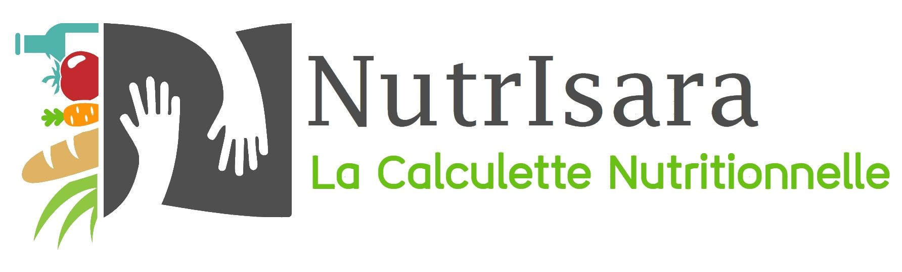

```{r setup, include=FALSE}
library(knitr)
```

```{r logo, echo=FALSE, out.width = '50%'}

```
&nbsp;

# *Informations générales* :

```{r nom, eval=FALSE, echo=FALSE}
# The `params` object is available in the document.
params$nom
```
Nom de l'opérateur : `r params$nom`
```{r date, eval=FALSE, echo=FALSE}
# The `params` object is available in the document.
params$dateCre
```
Date de création : `r params$dateCre`
```{r datemsj, eval=FALSE, echo=FALSE}
# The `params` object is available in the document.
params$datemsj
```
Date de mise à jour : `r params$datemsj`

```{r nrecette, eval=FALSE, echo=FALSE}
# The `params` object is available in the document.
params$nrecette
```
Nom de la recette : `r params$nrecette`

# *Valeur nutritionnelle* :

```{r tableau, eval=TRUE, echo=FALSE}
# The `params` object is available in the document.
knitr::kable(params$tab, caption = "Exemple de tableau")
```

Proportion d'éléments :
```{r pierecette, eval=TRUE, echo=FALSE}
# The `params` object is available in the document.

```